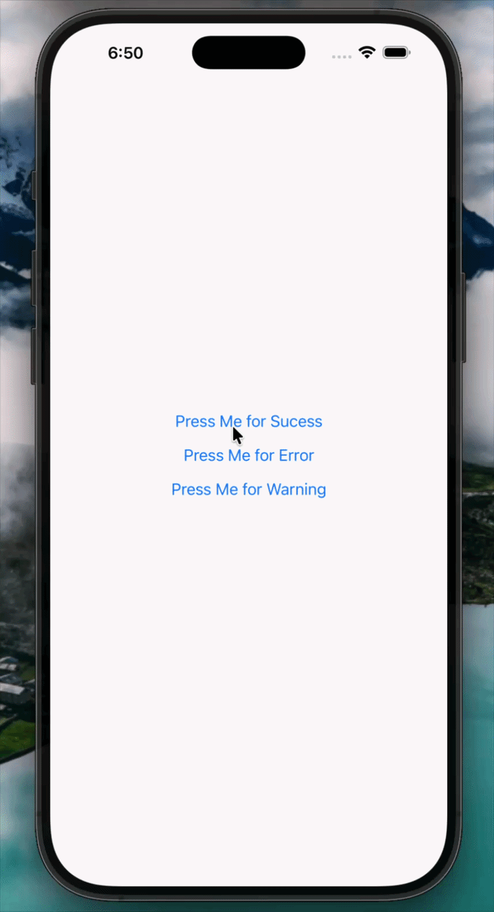

# 🍞 react-native-toastfx

Beautiful, animated toast notifications for React Native — powered by [Reanimated 4](https://docs.swmansion.com/react-native-reanimated/).

> Stacked. Smooth. Fully typed.



---

## ✨ Features

- 🎨 Three toast types — `success`, `warning`, `error`
- 🪄 Fluid spring animations powered by Reanimated 4
- 📚 Smart stacking — newest toast always on top, max 3 at once
- 👻 Progressive opacity fade — older toasts ghost out
- ✏️ Custom `title` and `message` per toast
- 🎛️ Global `titleStyle` and `messageStyle` overrides
- ⏱️ Configurable auto-dismiss duration
- 📦 Full TypeScript support
- ✅ Works with Expo and bare React Native

---

## 📦 Installation

```sh
yarn add react-native-toastfx react-native-reanimated react-native-worklets eventemitter3
```

Then add the worklets Babel plugin to your `babel.config.js` — **it must be the last plugin**:

```js
module.exports = {
  presets: ['babel-preset-expo'], // or 'module:@react-native/babel-preset'
  plugins: [
    'react-native-worklets/plugin', // ← must be last
  ],
};
```

> For Expo managed workflow, run `npx expo install react-native-reanimated react-native-worklets` to get the SDK-compatible versions.

---

## 🚀 Quick Start

### 1. Mount `<Toast />` once at your app root

```tsx
// App.tsx
import { View } from 'react-native';
import Toast from 'react-native-toastfx';

export default function App() {
  return (
    <View style={{ flex: 1 }}>
      <YourApp />
      <Toast /> {/* ← mount once, above everything */}
    </View>
  );
}
```

### 2. Trigger toasts from anywhere

```tsx
import { showSuccess, showError, showWarning } from 'react-native-toastfx';

// Minimal
showSuccess({ message: 'Profile saved!' });

// With custom title
showError({ title: 'Uh oh!', message: 'Something went wrong.' });

// With custom duration
showWarning({
  title: 'Heads up',
  message: 'Storage is almost full.',
  duration: 2000,
});
```

---

## 📖 API

### `showSuccess(options)`

### `showError(options)`

### `showWarning(options)`

| Prop       | Type     | Required | Default                               | Description                                 |
| ---------- | -------- | -------- | ------------------------------------- | ------------------------------------------- |
| `message`  | `string` | ✅       | —                                     | The body text of the toast                  |
| `title`    | `string` | ❌       | `"Success"` / `"Error"` / `"Warning"` | Custom title — falls back to the type label |
| `duration` | `number` | ❌       | `4000`                                | Auto-dismiss time in milliseconds           |

---

### `<Toast />`

Mount this **once** at the root of your app. It listens to the global event emitter and renders toasts on top of all other content.

| Prop           | Type        | Required | Default | Description                                           |
| -------------- | ----------- | -------- | ------- | ----------------------------------------------------- |
| `titleStyle`   | `TextStyle` | ❌       | —       | Override text style for the title across all toasts   |
| `messageStyle` | `TextStyle` | ❌       | —       | Override text style for the message across all toasts |

```tsx
<Toast
  titleStyle={{ fontFamily: 'Inter-Bold', fontSize: 13 }}
  messageStyle={{ color: '#94a3b8', fontSize: 13 }}
/>
```

---

## 🎬 Animations

Each toast is animated with Reanimated 4 springs and timing functions:

| Animation        | Detail                                                           |
| ---------------- | ---------------------------------------------------------------- |
| **Entry**        | Slides down from above with a spring bounce + fade in + scale up |
| **Icon**         | Pops in with an overshoot spring + rotation unwind               |
| **Progress bar** | Linearly drains over the toast's duration                        |
| **Stack shift**  | Smoothly re-scales and fades when a new toast arrives            |
| **Exit**         | Springs back up off-screen with a fade out                       |

---

## 📚 Stack Behavior

- Maximum **3 toasts** visible at once
- New toasts appear at the **top**
- When a 4th toast arrives, the **oldest is replaced**
- Toasts progressively fade by age:

| Position        | Opacity | Scale  |
| --------------- | ------- | ------ |
| Newest (top)    | `1.0`   | `1.00` |
| Middle          | `0.55`  | `0.95` |
| Oldest (bottom) | `0.25`  | `0.90` |

---

## 🧩 Full Example

```tsx
import React from 'react';
import { View, Button, StyleSheet } from 'react-native';
import Toast, {
  showSuccess,
  showError,
  showWarning,
} from 'react-native-toastfx';

export default function App() {
  return (
    <View style={styles.container}>
      <Button
        title="Show Success"
        onPress={() =>
          showSuccess({
            title: 'Saved!',
            message: 'Your changes have been saved.',
          })
        }
      />
      <Button
        title="Show Error"
        onPress={() =>
          showError({
            message: 'Failed to connect. Please try again.',
            duration: 4000,
          })
        }
      />
      <Button
        title="Show Warning"
        onPress={() =>
          showWarning({
            title: 'Low storage',
            message: 'You are running out of space.',
          })
        }
      />

      <Toast
        titleStyle={{ fontWeight: '800' }}
        messageStyle={{ opacity: 0.85 }}
      />
    </View>
  );
}

const styles = StyleSheet.create({
  container: {
    flex: 1,
    justifyContent: 'center',
    gap: 12,
    padding: 24,
  },
});
```

---

## 🔧 Peer Dependencies

| Package                   | Version    |
| ------------------------- | ---------- |
| `react-native`            | `>= 0.73`  |
| `react-native-reanimated` | `>= 4.0.0` |
| `react-native-worklets`   | `>= 0.1.0` |
| `eventemitter3`           | `>= 5.0.0` |

---

## 📄 License

MIT © [Your Name](https://github.com/yourusername)
